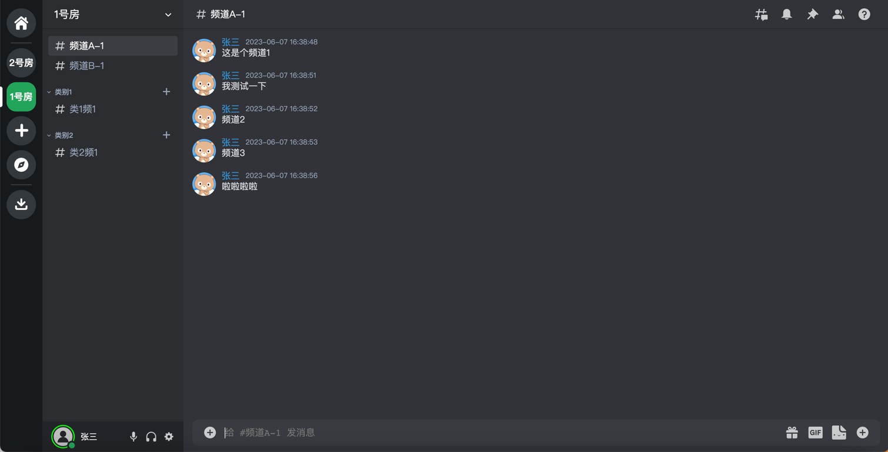
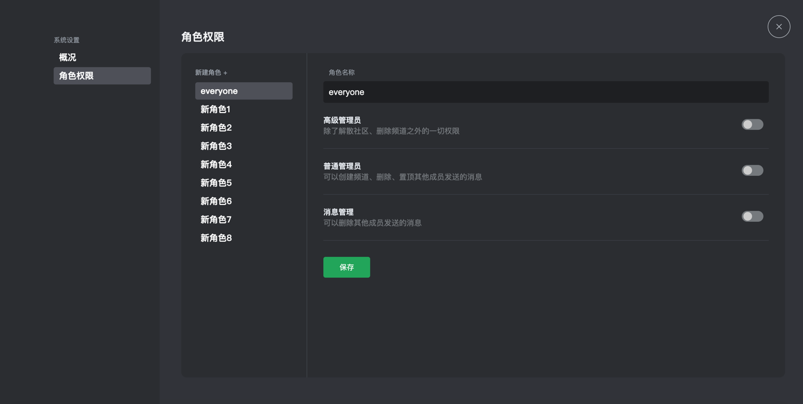
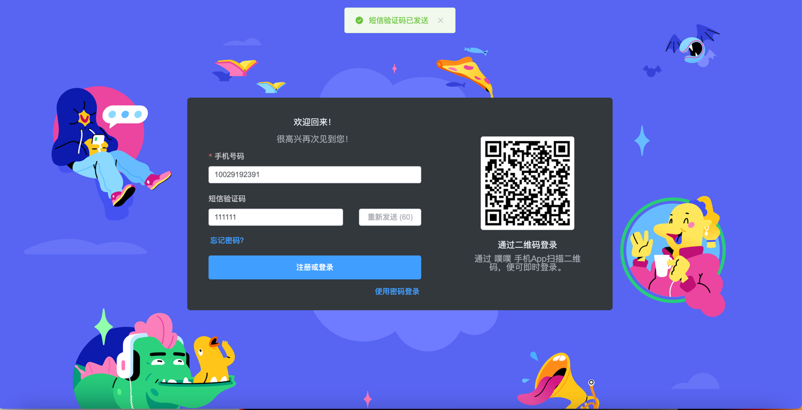

# 软件介绍
1. 高仿 Discord 、 KOOK （开黑啦） 的频道聊天软件 -- 网页客户端
2. IM 在线即时通讯，不限制人数，不限制聊天频道人数

# 其他端
服务端: https://github.com/sxs163mail/pupu-api

# 一些说明
1. 有同学想接着搞下去做点自己喜欢的东西来玩，不会部署的，可以加Q群 590587904，微信 puzv618 我协助你
2. 如果有愿意在当前产品上继续开发下去的同学就最好了，也欢迎来学习的在校同学

# 技术架构
1. 服务端: java spring-boot + mongoDB
2. 客户端: vue3 
3. 长连接: emqx MQTT 频道订阅的方式

# 负载均衡
1. 服务端代码无状态可以无限制扩容
2. MongoDB容量上限后，可以做集群
3. 在spring-boot的service层添加redis的cache
4. emqx mqtt支持配置集群

# 目前情况
1. 基本创建社区、频道、频道分类、聊天、等功能大体能用
2. 注册登录可以用，没部署阿里云，还不支持手机验证码，目前服务器写死验证码 111111
3. 所有接口，没限制权限，谁来都是admin

# 作者情况
1. 32岁，08年入行软件研发，爱java，从事IM后端研发多年，三亿社交用户经验，实操2千万在线长连接用户，消息量级3万QPS/秒
2. 也做过android, vue, py, php, c#等其他一系列
3. 最近在学前端，在家自律有点差，想找点IM爱好者或者学生党一起来玩

# 示例图片

#### 1. 聊天主界面

#### 2. 角色权限设置页

#### 3. 登录主界面

